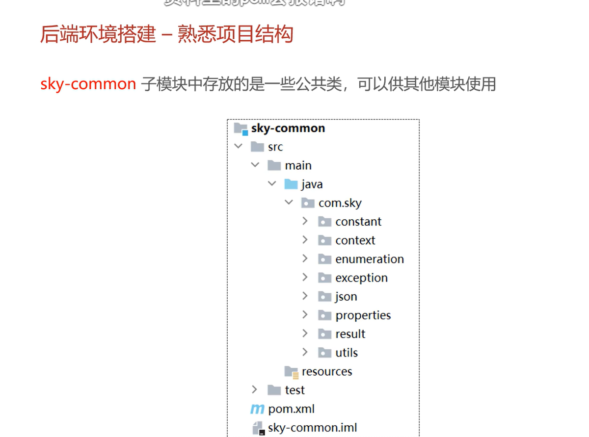
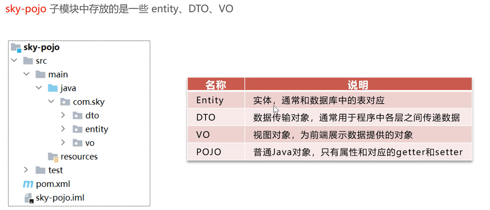
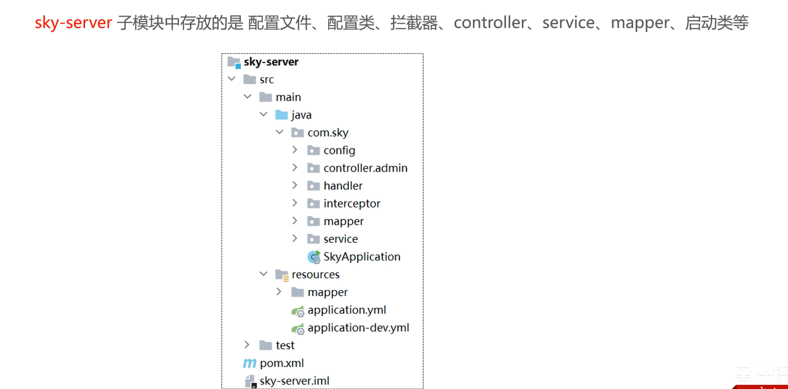

# 开发环境搭建

## 分模块管理

`sky-common`模块




`sky-pojo`模块




`sky-server`模块




## 对于常量的封装的说明

不喜欢 简单的一句话还要用变量单独设置，虽然方便维护，但是可读性很差。所以我整个代码中几乎没有用自己定义的常量。

大型项目最好还是使用变量接收

# 员工管理

## 表单校验

发现老师没有使用表单校验，于是我在后端加上了表单校验（当然前端也有）

````xml
        <dependency>
            <groupId>org.springframework.boot</groupId>
            <artifactId>spring-boot-starter-validation</artifactId>
        </dependency>
````

引入这个依赖，然后直接在DTO上加注解，然后在Conroller层加上注解即可

```java
package com.Tuning.dto;

import jakarta.validation.constraints.NotBlank;
import jakarta.validation.constraints.Pattern;
import jakarta.validation.constraints.Size;
import lombok.AllArgsConstructor;
import lombok.Data;
import lombok.NoArgsConstructor;

@Data
@AllArgsConstructor
@NoArgsConstructor
public class EmployeeUpdateDTO {
  @NotBlank(message = "id不能为空")
  private Long id;

  @NotBlank(message = "用户名不能为空")
  private String username;

  @NotBlank(message = "名字不能为空")
  private String name;

  @Pattern(regexp = "^\\d{11}$", message = "手机号格式不正确")
  private String phone;

  @Size(max = 1, message = "性别长度不正确")
  private String sex;

  @NotBlank(message = "身份证号不能为空")
  private String idNumber;
}

```


## DTO和VO的完善

视频中有时候老师偷懒了，VO和Entity一样的就没有新开，不过我都设置好了。也没有因为不同接口（登录和编辑）的VO一样而就写了一个VO，我也是分开写了。只有Entity的代码是抄老师的（其实就是数据库的），**VO和DTO的代码都是自己慢慢实现功能加上的**。

